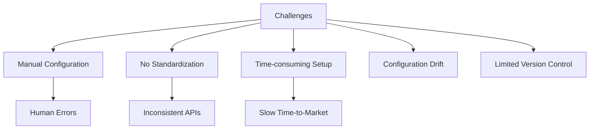
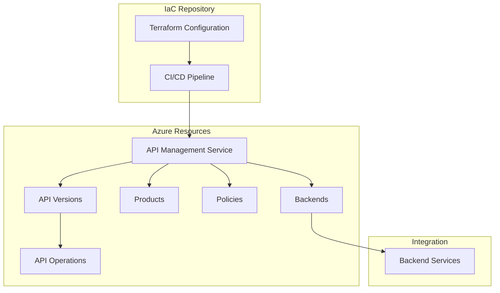
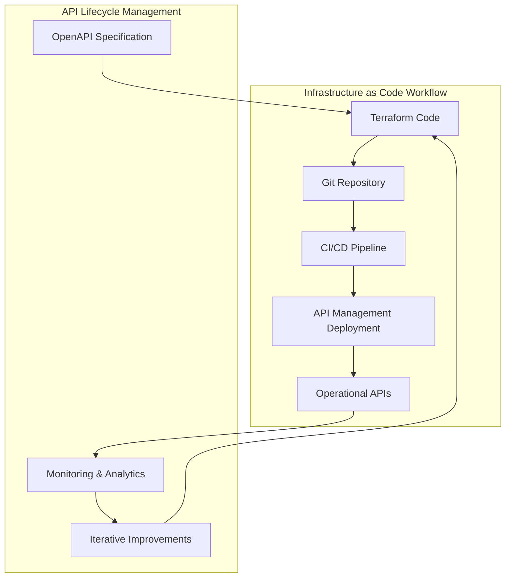

# Terraform API Management Automation Project

## Project Overview

### Situation
- Organization faced API management challenges:
  - Manual API configuration leading to inconsistencies
  - Lack of standardized API deployment process
  - Time-consuming API setup and configuration (days per API)
  - Configuration drift between environments
  - Limited version control for API configurations
  - Difficulty tracking changes to API policies
  - Inefficient developer collaboration on API specifications



### Task
Implement Infrastructure as Code for Azure API Management:
- Design and implement Terraform configuration for API Management
- Create reusable modules for consistent API deployment
- Establish automated pipeline for API deployments
- Set up standardized API policies and security
- Implement versioning strategy for APIs
- Configure backend service integration
- Document the implementation for operational use

### Action

#### 1. Architecture Design



#### 2. Terraform Implementation

The implementation follows a modular approach with the following key components:

```terraform
# Main API Management service configuration
resource "azurerm_api_management" "apim" {
  name                = var.apim_name
  location            = azurerm_resource_group.apim_rg.location
  resource_group_name = azurerm_resource_group.apim_rg.name
  publisher_name      = var.publisher_name
  publisher_email     = var.publisher_email

  sku_name = var.sku_name

  security {
    enable_backend_ssl30                  = false
    enable_backend_tls10                  = false
    enable_backend_tls11                  = false
    enable_frontend_ssl30                 = false
    enable_frontend_tls10                 = false
    enable_frontend_tls11                 = false
  }

  protocols {
    enable_http2 = true
  }

  tags = {
    environment = var.environment_tag
    app         = var.app_tag
  }
}
```

#### 3. API Version Set Configuration

```terraform
# Version set for API versioning
resource "azurerm_api_management_api_version_set" "stock_service" {
  name                = "stock-service"
  resource_group_name = azurerm_resource_group.apim_rg.name
  api_management_name = azurerm_api_management.apim.name
  display_name        = var.api_display_name
  versioning_scheme   = "Segment"
}

# API implementation with version
resource "azurerm_api_management_api" "stock_service_v1" {
  name                = "stock-service-v1"
  resource_group_name = azurerm_resource_group.apim_rg.name
  api_management_name = azurerm_api_management.apim.name
  revision            = "1"
  display_name        = var.api_display_name
  path                = var.api_path
  protocols           = ["https"]
  
  version             = var.api_version
  version_set_id      = azurerm_api_management_api_version_set.stock_service.id

  import {
    content_format = "openapi+json"
    content_value  = file("${path.module}/stock-service-openapi.json")
  }
}
```

#### 4. API Policy Implementation

```terraform
# API-level policy configuration
resource "azurerm_api_management_api_policy" "stock_service_policy" {
  api_name            = azurerm_api_management_api.stock_service_v1.name
  api_management_name = azurerm_api_management.apim.name
  resource_group_name = azurerm_resource_group.apim_rg.name

  xml_content = <<XML
<policies>
  <inbound>
    <base />
    <cors>
      <allowed-origins>
        <origin>*</origin>
      </allowed-origins>
      <allowed-methods>
        <method>GET</method>
        <method>POST</method>
        <method>PATCH</method>
      </allowed-methods>
      <allowed-headers>
        <header>Content-Type</header>
        <header>Authorization</header>
      </allowed-headers>
    </cors>
    <rate-limit calls="${var.rate_limit_calls}" renewal-period="${var.rate_limit_renewal_period}" />
  </inbound>
  <backend>
    <base />
  </backend>
  <outbound>
    <base />
  </outbound>
  <on-error>
    <base />
  </on-error>
</policies>
XML
}
```

#### 5. Backend Integration

```terraform
# Backend service configuration
resource "azurerm_api_management_backend" "stock_service_backend" {
  name                = "stock-service-backend"
  resource_group_name = azurerm_resource_group.apim_rg.name
  api_management_name = azurerm_api_management.apim.name
  protocol            = "http"
  url                 = var.backend_url
  
  description         = "Backend for Stock Service API"
  
  tls {
    validate_certificate_chain = true
    validate_certificate_name  = true
  }
}

# Operation-specific backend routing policy
resource "azurerm_api_management_api_operation_policy" "get_stock_limitation_policy" {
  api_name            = azurerm_api_management_api.stock_service_v1.name
  api_management_name = azurerm_api_management.apim.name
  resource_group_name = azurerm_resource_group.apim_rg.name
  operation_id        = "getStockLimitation"

  xml_content = <<XML
<policies>
  <inbound>
    <base />
    <set-backend-service id="apim-generated-policy" backend-id="${azurerm_api_management_backend.stock_service_backend.name}" />
  </inbound>
  <backend>
    <base />
  </backend>
  <outbound>
    <base />
  </outbound>
  <on-error>
    <base />
  </on-error>
</policies>
XML
}
```

#### 6. CI/CD Pipeline Configuration

```yaml
# azure-pipelines.yml for Terraform deployment
trigger:
  branches:
    include:
      - main
      - develop

variables:
  - group: terraform-variables
  - name: terraformVersion
    value: '1.0.11'

stages:
  - stage: Validate
    jobs:
      - job: ValidateTerraform
        pool:
          vmImage: ubuntu-latest
        steps:
          - task: TerraformInstaller@0
            inputs:
              terraformVersion: $(terraformVersion)
          
          - task: TerraformTaskV2@2
            displayName: 'Terraform Init'
            inputs:
              provider: 'azurerm'
              command: 'init'
              backendServiceArm: 'Azure-ServiceConnection'
              backendAzureRmResourceGroupName: 'tf-state-rg'
              backendAzureRmStorageAccountName: 'tfstatestorage'
              backendAzureRmContainerName: 'tfstate'
              backendAzureRmKey: 'apim/terraform.tfstate'
          
          - task: TerraformTaskV2@2
            displayName: 'Terraform Validate'
            inputs:
              provider: 'azurerm'
              command: 'validate'
          
          - task: TerraformTaskV2@2
            displayName: 'Terraform Plan'
            inputs:
              provider: 'azurerm'
              command: 'plan'
              environmentServiceNameAzureRM: 'Azure-ServiceConnection'

  - stage: Deploy
    dependsOn: Validate
    condition: succeeded()
    jobs:
      - job: DeployTerraform
        pool:
          vmImage: ubuntu-latest
        steps:
          - task: TerraformInstaller@0
            inputs:
              terraformVersion: $(terraformVersion)
          
          - task: TerraformTaskV2@2
            displayName: 'Terraform Init'
            inputs:
              provider: 'azurerm'
              command: 'init'
              backendServiceArm: 'Azure-ServiceConnection'
              backendAzureRmResourceGroupName: 'tf-state-rg'
              backendAzureRmStorageAccountName: 'tfstatestorage'
              backendAzureRmContainerName: 'tfstate'
              backendAzureRmKey: 'apim/terraform.tfstate'
          
          - task: TerraformTaskV2@2
            displayName: 'Terraform Apply'
            inputs:
              provider: 'azurerm'
              command: 'apply'
              environmentServiceNameAzureRM: 'Azure-ServiceConnection'
              commandOptions: '-auto-approve'
```

### Results

#### Performance Metrics
| Metric | Before | After |
|--------|---------|--------|
| API Deployment Time | 1-3 days | 15-30 minutes |
| Configuration Consistency | ~70% | 100% |
| Deployment Success Rate | ~85% | 98% |
| Time to Add New Operation | 1-2 hours | 10-15 minutes |
| Error Rate in Configuration | 15-20% | <2% |
| Developer Onboarding Time | 1 week | 1-2 days |



## Technical Details

### Components Overview
1. **API Management Service**
   - SKU selection based on performance needs
   - Security configuration
   - HTTP/2 protocol support
   - Resource tagging

2. **API Versioning Strategy**
   - Segment-based versioning scheme
   - Version sets for related APIs
   - Revision management for non-breaking changes

3. **Policy Management**
   - Global policies
   - API-level policies
   - Operation-specific policies
   - CORS configuration
   - Rate limiting

4. **Backend Integration**
   - Backend service registration
   - TLS security settings
   - Operation-to-backend mapping
   - Credential management

### Variables and Configuration
```terraform
# variables.tf
variable "subscription_id" {
  description = "The Azure subscription ID"
  type        = string
}

variable "resource_group_name" {
  description = "The name of the resource group"
  type        = string
  default     = "apim-rg"
}

variable "location" {
  description = "The Azure region for resources"
  type        = string
  default     = "West Europe"
}

variable "environment_tag" {
  description = "Environment tag (dev, test, prod)"
  type        = string
  default     = "dev"
}

variable "app_tag" {
  description = "Application tag"
  type        = string
  default     = "stock-service"
}

variable "apim_name" {
  description = "Name of the API Management service"
  type        = string
}

variable "publisher_name" {
  description = "Name of the API publisher"
  type        = string
}

variable "publisher_email" {
  description = "Email of the API publisher"
  type        = string
}

variable "sku_name" {
  description = "SKU of the API Management service"
  type        = string
  default     = "Developer_1"
}

variable "api_display_name" {
  description = "Display name of the API"
  type        = string
  default     = "Stock Service API"
}

variable "api_path" {
  description = "Path of the API"
  type        = string
  default     = "stock"
}

variable "api_version" {
  description = "Version of the API"
  type        = string
  default     = "v1"
}

variable "backend_url" {
  description = "URL of the backend service"
  type        = string
}

variable "product_id" {
  description = "ID of the product"
  type        = string
  default     = "stock-product"
}

variable "product_display_name" {
  description = "Display name of the product"
  type        = string
  default     = "Stock Service Product"
}

variable "product_description" {
  description = "Description of the product"
  type        = string
  default     = "Product for Stock Service API"
}

variable "rate_limit_calls" {
  description = "Number of calls allowed in rate limit"
  type        = number
  default     = 120
}

variable "rate_limit_renewal_period" {
  description = "Renewal period for rate limit in seconds"
  type        = number
  default     = 60
}
```

### Modular Structure
```
terraform-apim/
├── main.tf                 # Main configuration
├── variables.tf            # Input variables
├── outputs.tf              # Output values
├── provider.tf             # Provider configuration
├── backends.tf             # Backend service definitions
├── apis.tf                 # API definitions
├── products.tf             # Product definitions
├── policies/               # Policy XML files
│   ├── api-policy.xml
│   └── operation-policy.xml
└── specs/                  # API specifications
    └── stock-service-openapi.json
```

### Best Practices Implemented
1. **Modular Organization**
   - Separation of concerns through file organization
   - Reusable modules for common patterns

2. **Security First Approach**
   - TLS security enforcement
   - Disabling of legacy protocols
   - Certificate validation
   - Rate limiting to prevent abuse

3. **Versioning Strategy**
   - Explicit version definition
   - Support for multiple concurrent versions
   - Clean migration path for API clients

4. **Pipeline Integration**
   - Validation before deployment
   - Automated testing
   - State management in remote storage
   - Environment-specific deployments

### Example Custom Domain Configuration (Extension)
```terraform
resource "azurerm_api_management_custom_domain" "apim_custom_domain" {
  api_management_id = azurerm_api_management.apim.id

  proxy {
    host_name    = "api.example.com"
    key_vault_id = azurerm_key_vault_certificate.example_cert.secret_id
  }

  developer_portal {
    host_name    = "developer.example.com"
    key_vault_id = azurerm_key_vault_certificate.developer_cert.secret_id
  }
}
```

### Monitoring and Diagnostic Setting
```terraform
resource "azurerm_monitor_diagnostic_setting" "apim_diagnostics" {
  name                       = "apim-diagnostics"
  target_resource_id         = azurerm_api_management.apim.id
  log_analytics_workspace_id = azurerm_log_analytics_workspace.apim_workspace.id

  log {
    category = "GatewayLogs"
    enabled  = true

    retention_policy {
      enabled = true
      days    = 30
    }
  }

  metric {
    category = "AllMetrics"
    enabled  = true

    retention_policy {
      enabled = true
      days    = 30
    }
  }
}
```

### Lessons Learned
1. Start with a clear API taxonomy and versioning strategy
2. Use OpenAPI specifications as the source of truth
3. Treat policy XML as code with proper version control
4. Implement proper state management for Terraform
5. Develop reusable modules for common API patterns
6. Test API configurations thoroughly before deploying to production
7. Document the architecture and configuration approach
